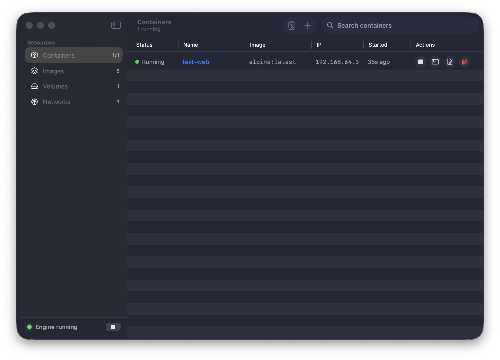

# ContainerDesk

Docker Desktop 스타일의 [Apple Container](https://github.com/apple/container) GUI 관리 앱 (SwiftUI, macOS 15+).



## Features

- **Containers** — 목록/검색, 시작·정지·kill·삭제, prune, 상태 폴링(3초), Run 시트(이미지·이름·포트·볼륨·환경변수·CPU/메모리·--rm)
- **Container 상세** — 실시간 로그 스트리밍(`logs --follow`, auto-scroll), Info 그리드, Inspect JSON 뷰어, Terminal.app 셸 열기(`exec -it`)
- **Images** — 목록/검색, pull(인기 이미지 추천 칩), 삭제, prune, 이미지에서 바로 컨테이너 실행
- **Volumes / Networks** — 목록, 생성, 삭제 (built-in 네트워크는 보호)
- **Engine 제어** — 사이드바 하단 상태 표시등 + start/stop 토글 (`container system start|stop`)

## Requirements

- macOS 15+ (Apple Silicon 권장)
- `container` CLI: `brew install container`
- 빌드 도구: Xcode 커맨드라인 툴, [xcodegen](https://github.com/yonaskolb/XcodeGen)

## Build & Run

```sh
xcodegen generate
xcodebuild -project ContainerDesk.xcodeproj -scheme ContainerDesk \
  -configuration Release -derivedDataPath build build CODE_SIGNING_ALLOWED=NO
open build/Build/Products/Release/ContainerDesk.app
```

앱에 넣으려면: `cp -R build/Build/Products/Release/ContainerDesk.app /Applications/`

## Tests

```sh
xcodebuild -project ContainerDesk.xcodeproj -scheme ContainerDeskTests \
  -derivedDataPath build test CODE_SIGNING_ALLOWED=NO
```

## Architecture

```
Sources/
├── App/            ContainerDeskApp(엔트리), AppStore(@Observable 상태 + 3s 폴링)
├── Core/
│   ├── CommandRunner.swift   외부 프로세스 async 실행 (파이프 데드락 방지)
│   ├── LogStream.swift       logs --follow 라인 스트리밍
│   ├── ContainerCLI.swift    container CLI 타입 래퍼 (--format json 파싱)
│   ├── Formatters.swift      ISO8601/상대시간/바이트 포맷
│   └── Models/               ContainerRecord, ImageRecord, VolumeRecord, NetworkRecord, SystemStatus
└── Views/
    ├── MainView, SidebarView(+EngineStatusBar)
    ├── Containers/  목록 Table, 상세(Logs·Info·Inspect), Run 시트
    ├── Images/      목록 Table, Pull 시트
    ├── Volumes/, Networks/, Components/
```

GUI 앱은 Finder 실행 시 PATH가 제한되므로 `container` 바이너리는 `/opt/homebrew/bin` 등 고정 후보 경로에서 탐색한다.
